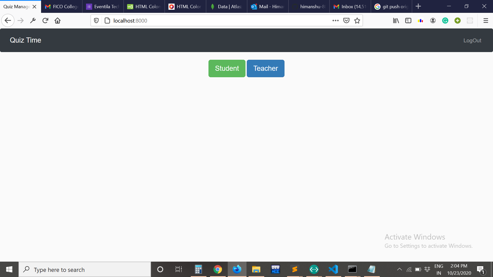
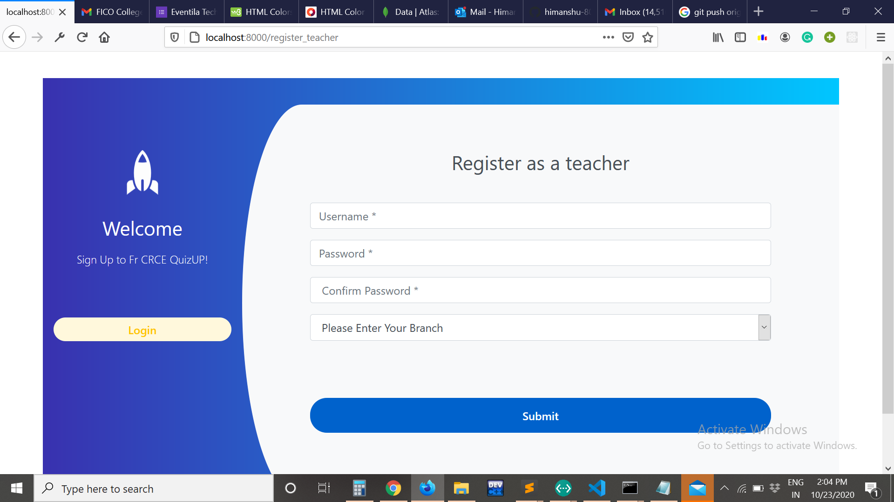
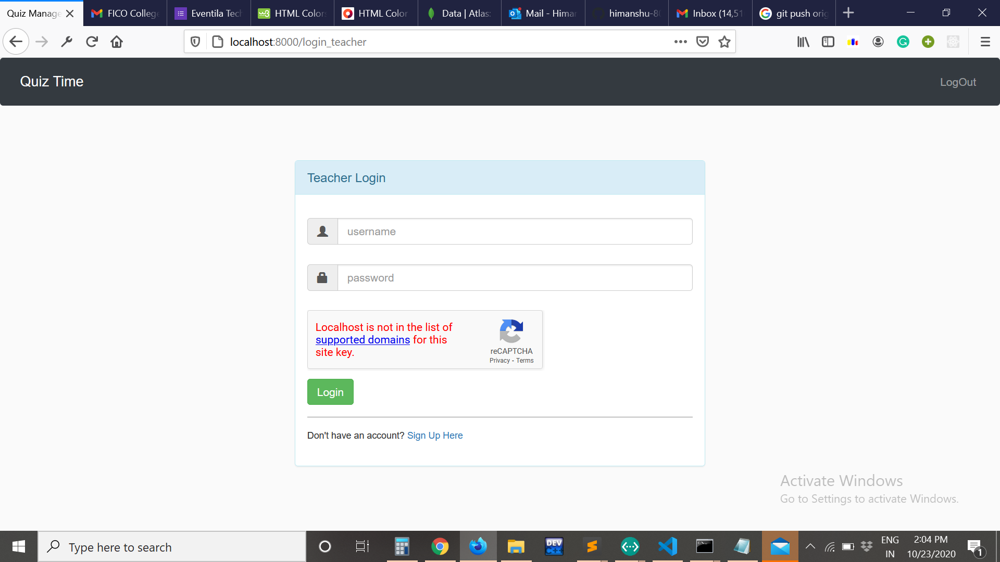
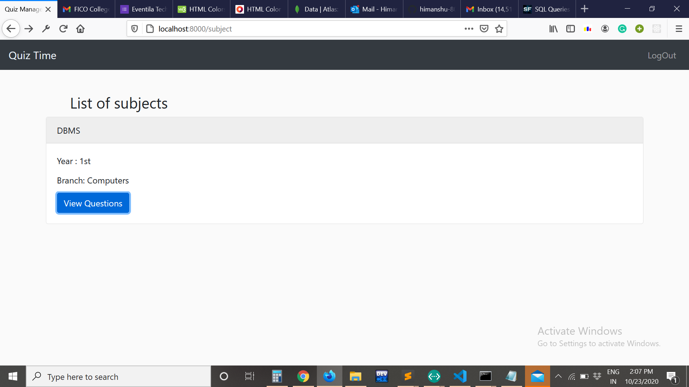
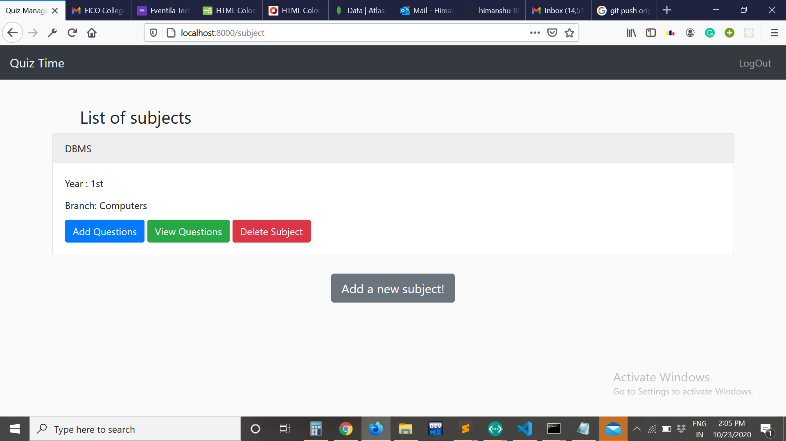
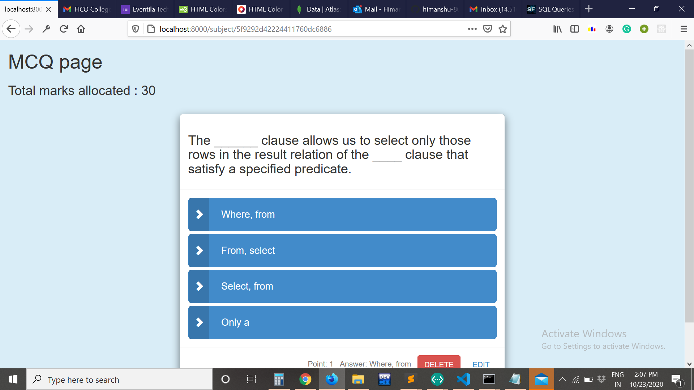

Welcome to Student- Teacher Quiz App  
Schema consists of User, Subject, MCQ  
-> Student from Particlar Year and Branch will get assigned quiz by their respective Teacher  
-> Teacher can edit, add and delete subject and particular question

Tech Stack Used-  
<b>Node.js</b> 
<b>Express.js</b> 
<b>MongoDb</b> 

Steps to run locally 

1. Install node.js
2. Download the zip folder
3. run command in terminal " npm i "
4. Open the brower with URL "localhost:8000"

## Feature

1. Support Login/Signup Authentication with passport.js
2. Student from particular branch and year will get Quiz, by their respected teacher.
3. Only 1 quiz set for particular subject

## TODO

- [ ] EDIT functionally Error
- [ ] Student report generation error.
- [ ] Need to upload app on heroku
       
       
       
      
        
      
        
      
        
      
        
      
        
      
        
